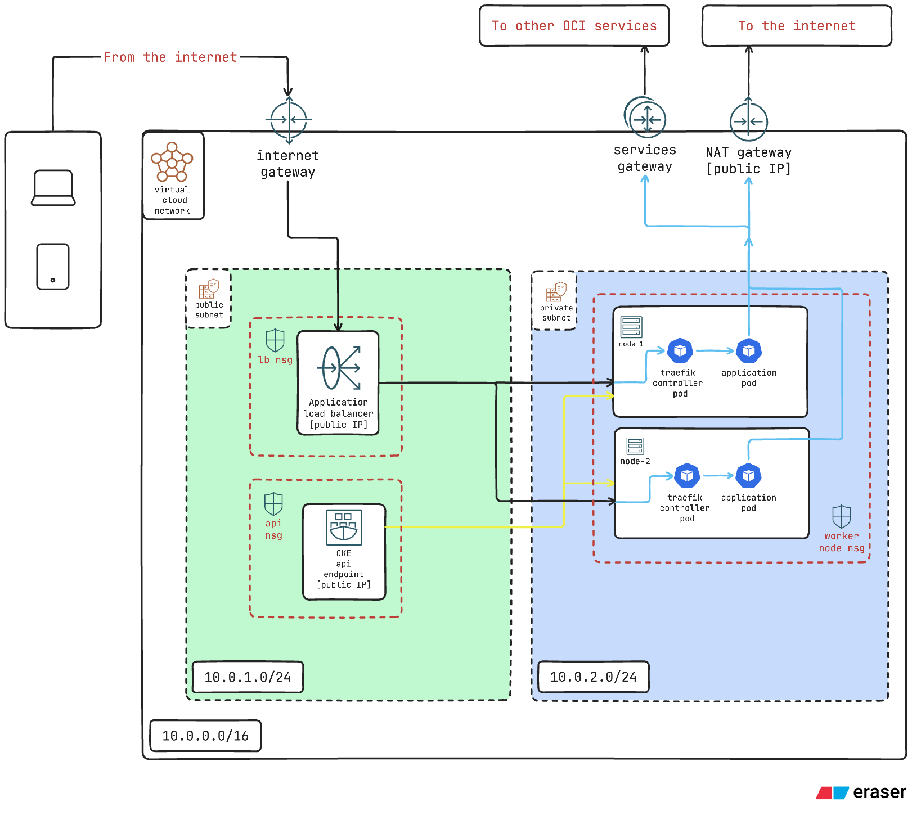

# OCI OKE Cluster — Terraform

Terraform modules that provision a managed Kubernetes cluster (OKE) on Oracle Cloud
Infrastructure, sized to fit within the OCI **Always Free** tier, plus an optional
post-apply script to install cert-manager, Traefik, and a Let's Encrypt ClusterIssuer.

---

## Contents

- [Architecture](#architecture)
- [Resources provisioned](#resources-provisioned)
- [Always Free cost](#always-free-cost)
- [Prerequisites](#prerequisites)
- [Usage](#usage)
  - [1. Configure `terraform.tfvars`](#1-configure-terraformtfvars)
  - [2. Terraform run commands](#2-terraform-run-commands)
  - [3. Enable API access](#3-enable-api-access)
  - [4. Install cluster add-ons (optional)](#4-install-cluster-add-ons-optional)
- [Outputs](#outputs)
- [Project layout](#project-layout)
- [Teardown](#teardown)

---

## Architecture

The diagram below shows the overall topology: the VCN with its public and private
subnets, the OKE control plane and worker node pool, and the in-cluster add-ons
(Traefik + cert-manager) that front traffic through an OCI load balancer.



> 📐 [View the full architecture diagram (SVG)](./oci-arch.png)

---

## Resources provisioned

A single `terraform apply` creates the following in your compartment (home region).

### Networking (`modules/network`)
- **VCN** `k8s-vcn` — `10.0.0.0/16`
- **Public subnet** `public-subnet` — `10.0.1.0/24` (hosts the public API endpoint + load balancers)
- **Private subnet** `private-subnet` — `10.0.2.0/24` (hosts worker nodes)
- **Internet Gateway** `k8s-vcn-igw`
- **NAT Gateway** `k8s-vcn-nat` (with a public IP)
- **Service Gateway** `k8s-vcn-sgw` (to "All Services In Oracle Services Network")
- **Route tables** `public-subnet-rt` (→ IGW) and `private-subnet-rt` (→ NAT + Service Gateway)
- **Network Security Groups**:
  - `k8s-lb-nsg` — ingress 80/443 from the internet, egress to node pool
  - `k8s-np-nsg` — worker node rules (intra-pool, API, LB, ICMP PMTU, egress)
  - `k8s-api-endpoint-nsg` — API endpoint rules + variable-driven ingress on 6443

### Cluster (`modules/cluster`)
- **OKE cluster** `k8s-cluster-01` — Kubernetes `v1.36.1`, **public** API endpoint (NSG attached)

### Node pool (`modules/nodepool`)
- **Node pool** `k8s-free-np`:
  - Shape `VM.Standard.A1.Flex` — **1 OCPU / 6 GB** per node
  - **2 nodes**, each with a **90 GB** boot volume
  - CNI `OCI_VCN_IP_NATIVE`, NIC launch type `PARAVIRTUALIZED`
  - Eviction grace `PT60M`
  - Node image resolved by display name
  - Defined tag `k8s.worker = "true"`

### Identity (`modules/iam`)
- **Tag namespace** `k8s` with tag key `worker` (string)
- **Dynamic group** `k8s-worker-nodes` — matches `tag.k8s.worker.value = 'true'`
- **Policy** `k8s-worker-node-policy` — compartment-scoped permissions for the OCI
  Cloud Controller Manager (load balancers, certificates, networking, read clusters/repos)
- **Policy** `oke-service-policy` — compartment-scoped OKE service permissions
  (toggle `oke_policy_broad = true` for the broad tenancy-wide statement)

### Add-ons (optional, via `scripts/install-addons.sh`)
- **cert-manager** (Helm, namespace `cert-manager`)
- **Traefik** ingress controller (Helm, namespace `traefik`) — provisions an OCI
  flexible Load Balancer in the public subnet
- **ClusterIssuer** `letsencrypt` (ACME HTTP-01 via Traefik)

---

## Always Free cost

This stack is deliberately sized to run at **no cost** on an OCI Always Free
tenancy. The relevant Always Free allowances (home region, for the life of the
account) and how this stack consumes them:

| Resource | Always Free allowance | This stack uses | Within free tier? |
|---|---|---|---|
| **OKE control plane** | **Basic clusters** are free (you pay only for worker nodes/resources) | 1 basic cluster | ✅ Free |
| **Ampere A1 compute** | **2 OCPUs + 12 GB RAM** total (across all A1 instances) | 2 nodes × (1 OCPU + 6 GB) = **2 OCPU / 12 GB** | ✅ Exactly at the limit |
| **Block Volume** | **200 GB** total (boot + block combined) | 2 × 90 GB boot = **180 GB** | ✅ Within (20 GB headroom) |
| **Flexible Load Balancer** | **1** LB at **10 Mbps** | 1 LB (created by Traefik Service, if add-ons installed) | ✅ Free at 10 Mbps |
| **VCN / subnets / gateways** | VCNs, IGW, NAT GW, Service GW, route tables, NSGs are free | 1 VCN + gateways | ✅ Free |
| **Outbound data transfer** | 10 TB/month | — | ✅ Free |

### Important caveats

- **A1 compute is at the hard limit.** 2 OCPUs / 12 GB is the *entire* Always Free
  A1 allowance. You cannot run any other A1 instance alongside this cluster without
  going over (and incurring charges). To leave room, reduce `node_count` to 1 or
  lower `node_ocpus` / `node_memory_in_gbs`.
- **Block volume headroom is thin.** 180 GB of 200 GB is used by boot volumes.
  Persistent-volume claims (PVCs) backed by Block Volume will push you over 200 GB
  and start incurring charges. The 20 GB remainder is small — plan storage
  accordingly or reduce `node_boot_volume_size_in_gbs`.
- **Load balancer bandwidth.** The Always Free LB is fixed at 10 Mbps. The Traefik
  override requests a flexible shape `10–100 Mbps`; the **10 Mbps minimum** is free,
  but if the LB scales above 10 Mbps it is billable. Keep the min at 10 to stay free.
- **"Always Free" shape only.** The A1.Flex shape is Always Free-eligible, but if
  your tenancy has exhausted its A1 allowance or you are on Pay As You Go, worker
  nodes are billed at standard A1 rates.
- **Idle reclamation.** Oracle may reclaim idle Always Free A1 instances (CPU, network,
  and memory all under 20% utilization over a 7-day window).
- **Home region only.** Always Free resources must be created in your tenancy's
  **home region**. Creating them elsewhere incurs standard charges. Set `region`
  accordingly.

> These figures reflect OCI's published Always Free limits at the time of writing.
> Oracle can change the program; always verify current limits and your actual bill
> in the OCI Console (**Billing & Cost Management**). This document is not a billing
> guarantee.

---

## Prerequisites

Install and have on your `PATH`:

- [Terraform](https://developer.hashicorp.com/terraform/downloads) ≥ 1.3
- [OCI CLI](https://docs.oracle.com/en-us/iaas/Content/API/SDKDocs/cliinstall.htm) (for the add-ons script / kubeconfig)
- `kubectl` and `helm` (only if you run `scripts/install-addons.sh`)

You also need:
- An OCI tenancy and a **compartment** OCID to deploy into.
- An **API signing key** uploaded to your OCI user. See
  [Required Keys and OCIDs](https://docs.oracle.com/en-us/iaas/Content/API/Concepts/apisigningkey.htm).
  You'll need the tenancy OCID, user OCID, key fingerprint, and the path to the
  private key `.pem`.

---

## Usage

### 1. Configure `terraform.tfvars`

Copy the example file and fill in your values:

```bash
cp terraform.tfvars.example terraform.tfvars
```

Then edit `terraform.tfvars`. At minimum, set the authentication and placement values:

```hcl
# --- Provider authentication ---
tenancy_ocid     = "ocid1.tenancy.oc1..aaaa..."
user_ocid        = "ocid1.user.oc1..aaaa..."
fingerprint      = "aa:bb:cc:dd:ee:ff:00:11:22:33:44:55:66:77:88:99"
private_key_path = "~/.oci/oci_api_key.pem"
region           = "ap-mumbai-1"          # must be your tenancy's HOME region for Always Free

# --- Placement ---
compartment_ocid = "ocid1.compartment.oc1..aaaa..."

# --- API access (leave empty for now; set in step 3) ---
api_allowed_cidrs = []
```

The remaining variables (`kubernetes_version`, node sizing, `oke_policy_broad`, etc.)
have sensible Always-Free defaults — override only if needed. See
`terraform.tfvars.example` and `variables.tf` for the full list.

`terraform.tfvars` is git-ignored (it contains secrets); only the `.example` is committed.

### 2. Terraform run commands

```bash
# Download the OCI provider and initialize modules
terraform init

# (optional) Check formatting and validate the configuration
terraform fmt -recursive
terraform validate

# Review what will be created
terraform plan

# Create the infrastructure
terraform apply
```

`terraform apply` provisions everything in [Resources provisioned](#resources-provisioned).
Cluster + node pool creation typically takes several minutes.

### 3. Enable API access

By default `api_allowed_cidrs = []`, which means **nothing can reach the Kubernetes
API on 6443** — intentional, so the public endpoint is not open to the world.

To use `kubectl` (and to run the add-ons script), add your machine's public IP:

```hcl
# in terraform.tfvars
api_allowed_cidrs = ["203.0.113.10/32"]   # replace with YOUR public IP /32
```

Then re-apply:

```bash
terraform apply
```

> Never set this to `0.0.0.0/0` in production — it exposes the Kubernetes API to the
> entire internet.

### 4. Install cluster add-ons (optional)

After the cluster is up and `api_allowed_cidrs` includes your IP:

```bash
./scripts/install-addons.sh
```

This script is **run manually by you — it is not invoked by Terraform.** It:
1. Reads `cluster_id`, `public_subnet_id`, `lb_nsg_id`, and `region` from `terraform output`.
2. Generates a `kubeconfig` (written to the project root, git-ignored) via the OCI CLI.
3. Verifies the API is reachable (fails fast if 6443 is still blocked).
4. Installs cert-manager and Traefik via Helm, injecting the live subnet/NSG OCIDs
   into the Traefik Load Balancer configuration.
5. Applies the `letsencrypt` ClusterIssuer.

After it finishes, find the Traefik Load Balancer's public IP and point your DNS at it:

```bash
KUBECONFIG=./kubeconfig kubectl -n traefik get svc traefik -w
```

---

## Outputs

After `terraform apply`, these outputs are available via `terraform output`:

| Output | Description |
|---|---|
| `vcn_id` | OCID of the VCN |
| `public_subnet_id` | OCID of the public subnet |
| `private_subnet_id` | OCID of the private subnet |
| `lb_nsg_id` | OCID of the load balancer NSG |
| `np_nsg_id` | OCID of the node pool NSG |
| `api_endpoint_nsg_id` | OCID of the API endpoint NSG |
| `cluster_id` | OCID of the OKE cluster |
| `cluster_public_endpoint` | Public Kubernetes API endpoint |
| `cluster_private_endpoint` | Private Kubernetes API endpoint |
| `node_pool_id` | OCID of the node pool |
| `worker_dynamic_group_name` | Name of the worker-nodes dynamic group |
| `worker_defined_tag_key` | Defined tag key applied to worker nodes |
| `region` | OCI region identifier |

---

## Project layout

```
.
├── main.tf                 # provider + module wiring
├── variables.tf            # root input variables
├── outputs.tf              # root outputs
├── versions.tf             # provider/version pins
├── terraform.tfvars.example
├── docs/
│   └── oci-arch.png        # architecture diagram (referenced in this README)
├── modules/
│   ├── network/            # VCN, subnets, gateways, route tables, NSGs
│   ├── cluster/            # OKE cluster
│   ├── nodepool/           # node pool + image lookup
│   └── iam/                # tag namespace, dynamic group, policies
├── addons/
│   ├── cert-manager/       # cert-manager Helm chart
│   ├── traefik/            # Traefik Helm chart + values.override.yaml
│   └── cluster-issuer/     # Let's Encrypt ClusterIssuer manifest
└── scripts/
    └── install-addons.sh   # post-apply add-on installer
```

---

## Teardown

```bash
terraform destroy
```

This removes all Terraform-managed resources. **Note:** the OCI Load Balancer created
by the Traefik Service is managed by Kubernetes, **not** Terraform. Delete it before
destroying, or it may be orphaned:

```bash
KUBECONFIG=./kubeconfig helm uninstall traefik -n traefik
# wait for the LB to be deleted, then:
terraform destroy
```
